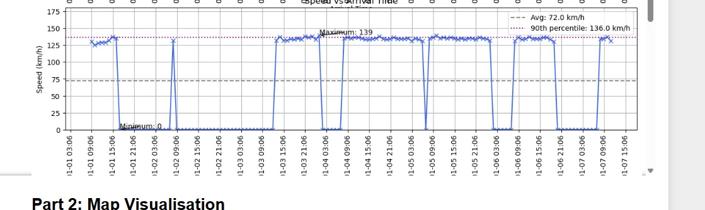
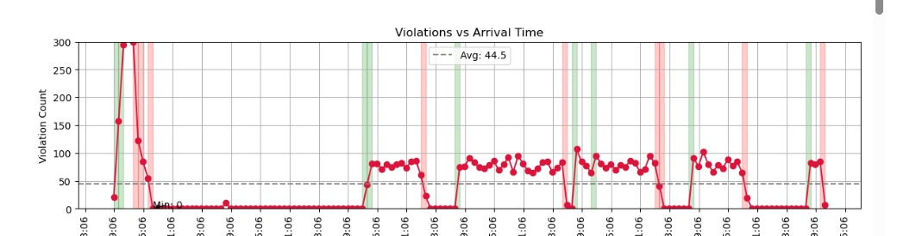
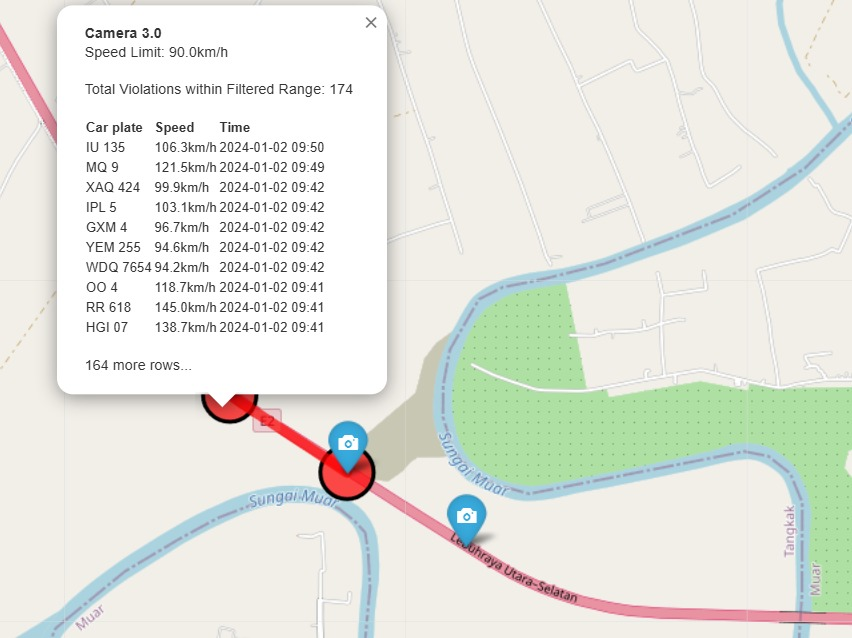

# FIT3182 Collaborative Docker Setup


## Overview


Malaysia’s road network is among the busiest and most accident-prone in Southeast Asia, with federal roads often seeing high rates of speeding, especially during peak travel times and festive seasons. Traditional enforcement methods like fixed speed and red-light cameras have proven ineffective, as drivers tend to slow down near the cameras and speed up afterward. To overcome these limitations, the Malaysian Government has introduced the Automated Awareness Safety System (AWAS), which uses paired cameras with license plate recognition to measure a vehicle’s average speed between two checkpoints. By calculating travel time over a set distance, the system accurately identifies speeding violations, ensuring more consistent and effective enforcement. This project simulates the idea of the system, with the given datasets provided by the University.


.png)

The system design of the project is based on the image **below**

.png)


# Data Visualisation

With the provided and post-processing of the data, we are able to visualise the number of violations onto a map to determine, where the violations have occurred and the frequency of the violations within a time period. 






## Requirements
- Docker
- Your teammate must have the same Docker images:
  - `fit3182/pyspark`
  - `fit3182/mongo`

## Usage
1. Clone this repo
2. Ensure you have the local images:
   - `docker images` should list `fit3182/pyspark` and `fit3182/mongo`
3. Run:
   ```
   docker-compose up
   ```
4. Access Jupyter at: http://localhost:8888

## Folder Structure
- `notebooks/`: Jupyter notebooks go here
- `data/`: Place your CSV or JSON datasets here

MongoDB is accessible inside the notebook via:
```python
from pymongo import MongoClient
client = MongoClient("mongodb://mongodb:27017")
db = client['fit3182']
```
